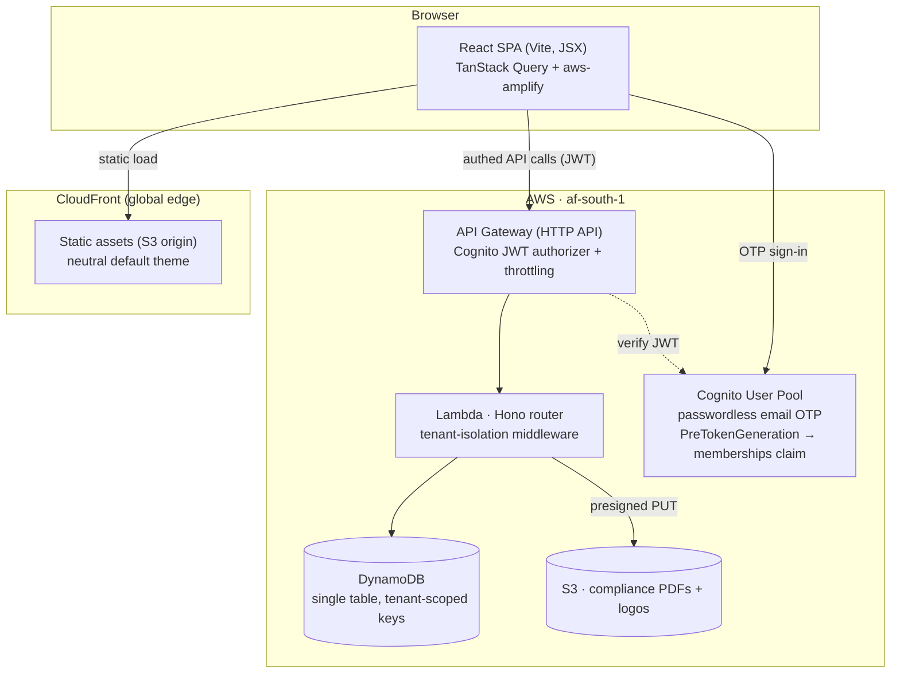

# Architecture overview

The Smart Club Platform is a multi-tenant SaaS for cricket unions (tenants) to run club
affiliation, compliance, the Club Quality Index (CQI), and fixtures for a season. Each union
gets its own branded site on its own subdomain; all unions share one backend.

It started as a per-union front-end prototype (Dolphins, then a Lions fork). The forks were
identical apart from branding and seed data, so the platform converges them into **one
codebase with per-tenant configuration** rather than maintaining N copies.

## System shape

## Key properties

- **Tenant isolation** is logical: one DynamoDB table, every item keyed under `TENANT#<t>#…`.
  Middleware derives the tenant from the authenticated request host (locked to custom domains)
  and the user's `memberships` claim, and rejects any cross-tenant access. See
  [data-model.md](data-model.md).
- **Branding is runtime configuration.** The SPA ships a neutral default theme
  (`index.html`) and applies the tenant's colors, copy, logo, favicon and hero image from
  the public `GET /tenant` payload at load. Tenants live in a DynamoDB registry managed
  from the operator portal (`/platform`) — see
  [ADR 0006](0006-platform-operator-and-tenant-registry.md). (ADR 0002's edge-resolved
  branding was never built.)
- **The API is a thin, tenant-scoped CRUD layer.** All dashboards, leaderboards, travel-cost,
  round-robin scheduling, and CQI scoring are computed in the browser from the full per-tenant
  `clubs[]`/`series[]` payloads. See [ADR 0004](0004-thin-crud-client-side-compute.md).
- **Region:** everything runs in `af-south-1` (Cape Town) for South African data residency
  (POPIA). CloudFront is the only global component (static assets).

## Decision records

| ADR                                                   | Decision                                               |
| ----------------------------------------------------- | ------------------------------------------------------ |
| [0001](0001-aws-native-dynamodb.md)                   | AWS-native backend on DynamoDB (not Supabase/Firebase) |
| [0002](0002-single-tenant-saas-vs-isolated-stacks.md) | One shared multi-tenant stack (not per-union stacks)   |
| [0003](0003-cognito-passwordless-memberships.md)      | Cognito passwordless OTP + `memberships[]` claim       |
| [0004](0004-thin-crud-client-side-compute.md)         | Thin CRUD API, computation stays client-side           |
| [0005](0005-frozen-catalogues-v1.md)                  | Districts/leagues/CQI frozen shared defaults in v1     |
| [0006](0006-platform-operator-and-tenant-registry.md) | Platform operator role, tenant registry, `/platform`   |

For the data layout and access patterns, see [data-model.md](data-model.md).
